= Tasks

== First task:

=== Valid anagram

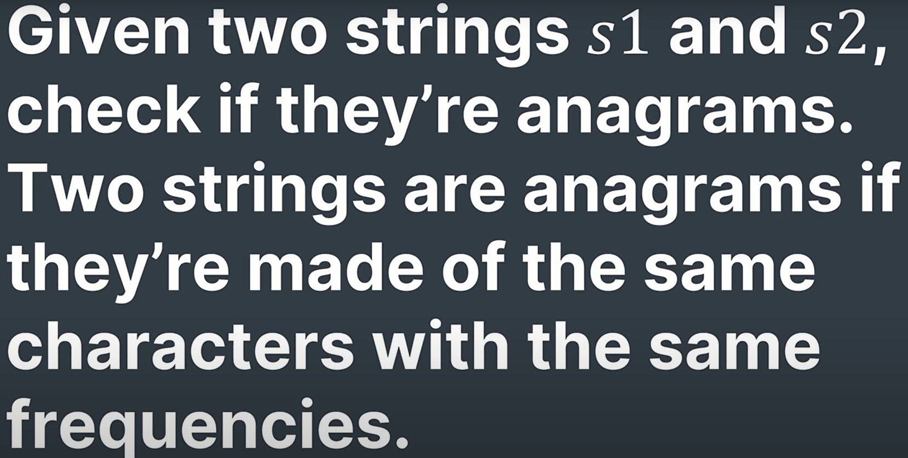

'''

== Second task:

== First and Last Index in Sorted Array

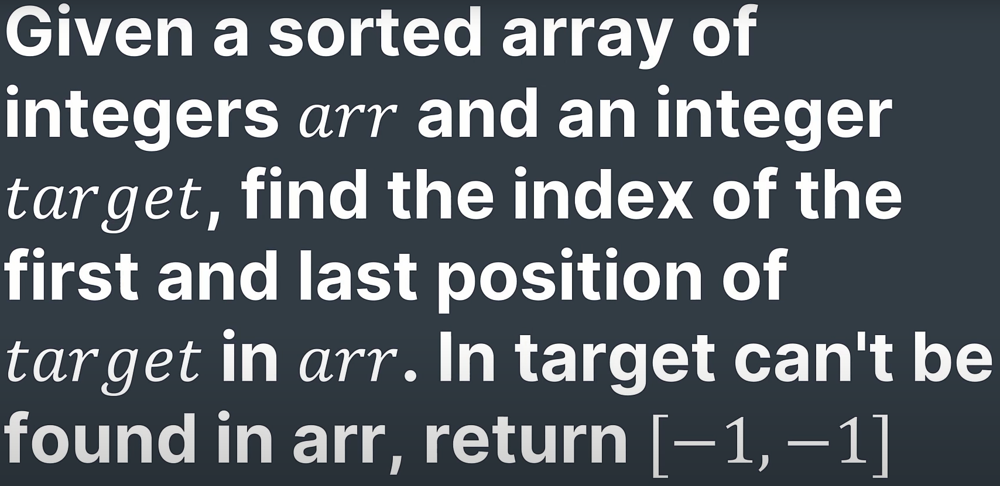

'''

== Third task:

== Kth Largest Element

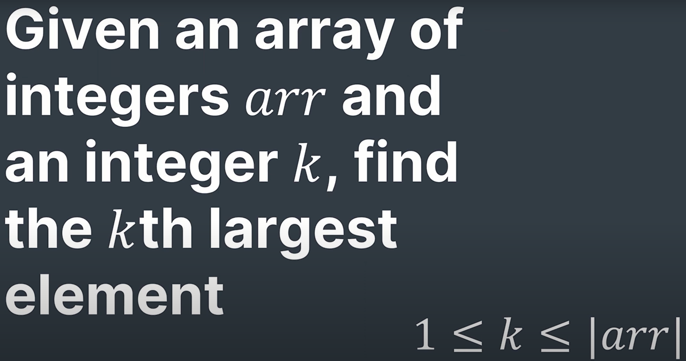

'''

== Forth task:

== Symmetric Tree

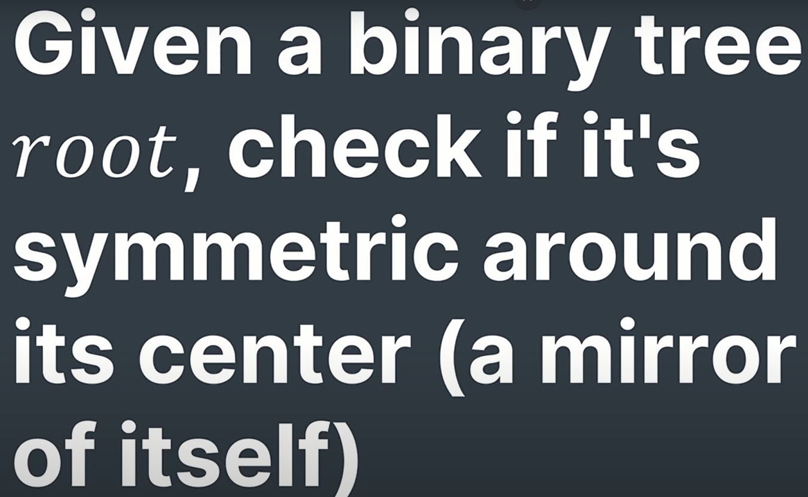

https://www.geeksforgeeks.org/symmetric-tree-tree-which-is-mirror-image-of-itself/

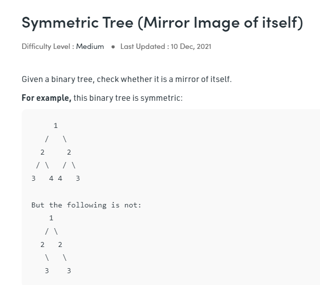

Examples:

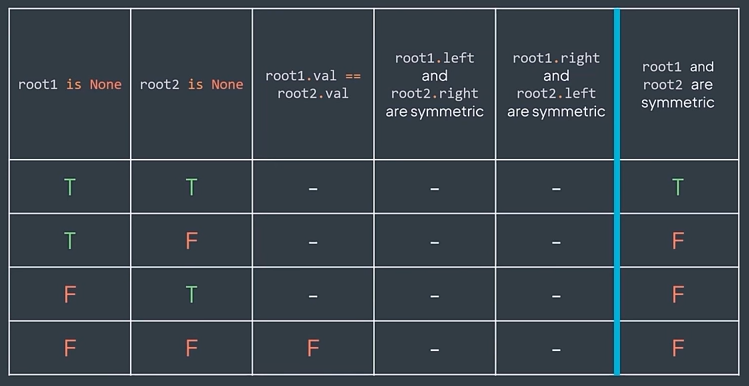

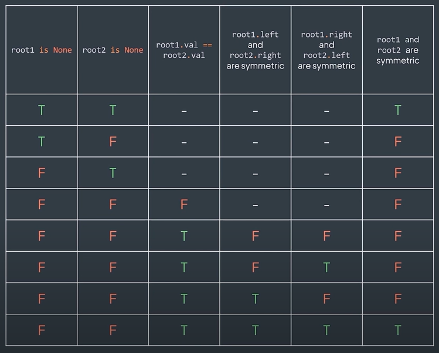

'''

== Fifth task:

=== Generate Parenthesis

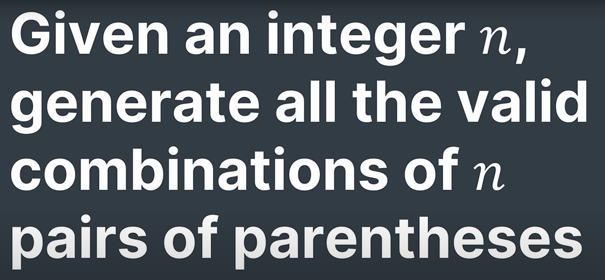

Explanation:

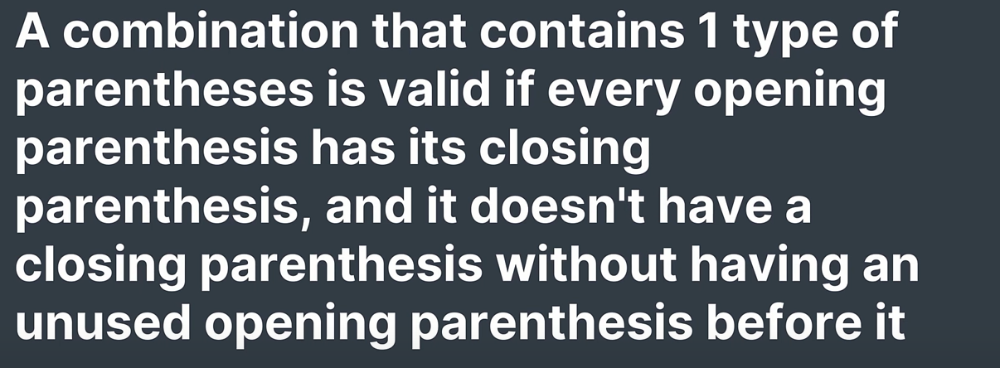

Invalid as follows:

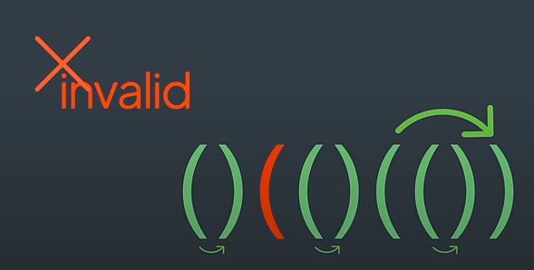

'''

== Sixth task:

=== Gas Station

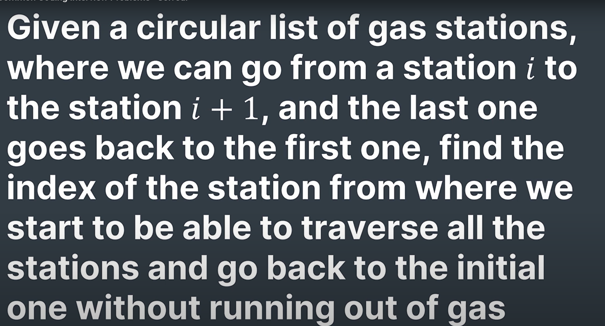

Explanation:

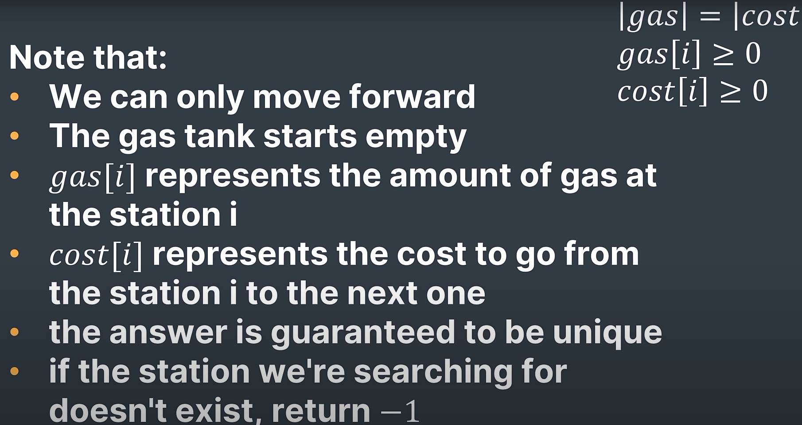

Example:

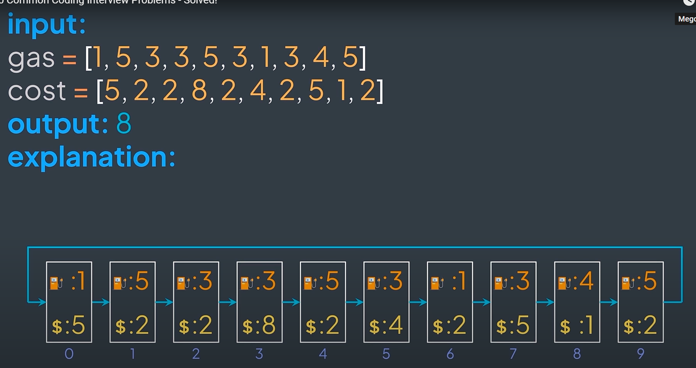

'''

== Seventh task:

=== Course Schedule

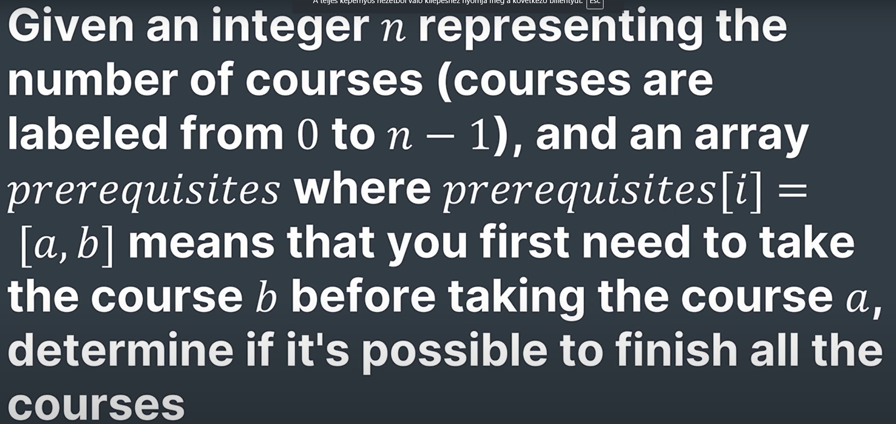

'''

== Eighth task:

=== Kth Permutation

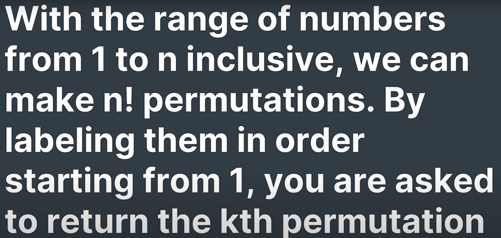

'''

== Ninth task:

=== Minimum window substring

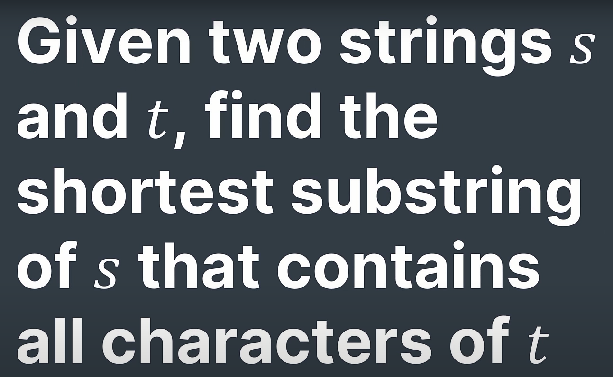

'''

== Tenth task:

=== Largest rectangle in histogram

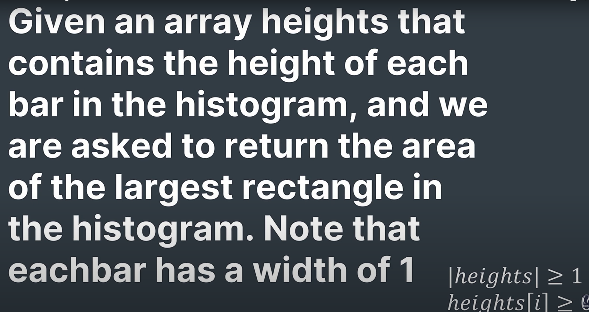

Example:

For example, given height = [2,1,5,6,2,3], return 10.

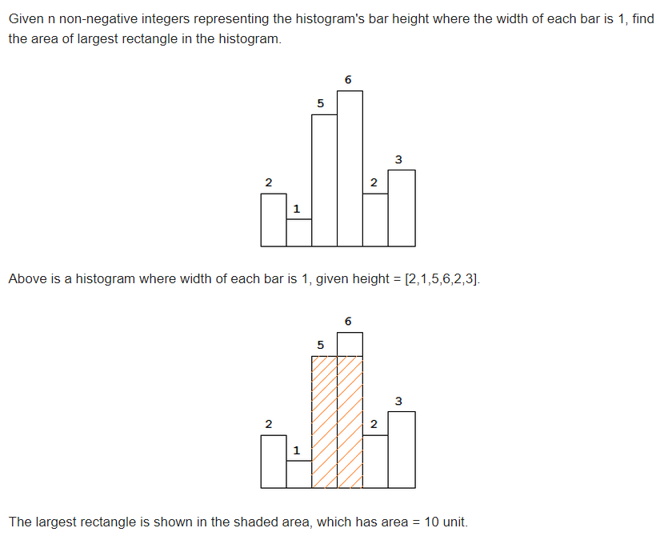